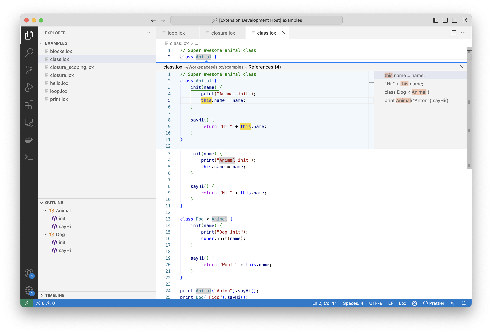

# Lox LSP

This extension provides comprehensive language support to the [Lox](https://craftinginterpreters.com/the-lox-language.html) language.

Lox is an educational language developed for the fantastic book "[Crafting Interpreters](https://craftinginterpreters.com/)" by [Bob Nystrom](https://twitter.com/munificentbob).

## Features

Features:

-   Basix syntax highlighting
-   [Semantic syntax highlighting](https://code.visualstudio.com/api/language-extensions/semantic-highlight-guide)
-   Go to definition
-   Find references
-   Go to symbol
-   Document outline
-   Rename symbol

## Why????

For me this is an educational fun exercise. I've been following along with the book to create an interpreter for Lox in TypeSript and thought it would be fun to also build up an LSP server in the process.
